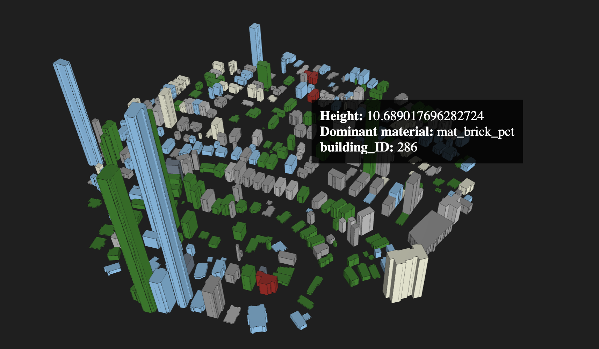

# imageable

[](https://github.com/scalable-design-participation-lab/imageable/actions/workflows/ci.yml)
[](https://badge.fury.io/py/imageable)
[](https://www.python.org/downloads/)
[](https://opensource.org/licenses/MIT)

An open-source Python library for extracting **43+ building properties** from street view images and building footprints. Designed for urban planners, architects, climate resilience researchers, and GIS professionals.



## Features

- **Height Estimation**: Estimate building heights from single street-level images using vanishing point detection and semantic segmentation
- **Material Analysis**: Segment and quantify façade materials (brick, glass, concrete, etc.)
- **Footprint Properties**: Extract 21 geometric, engineered, and contextual features from building polygons
- **Image Features**: Analyze color, shape, and façade characteristics from street view images
- **Batch Processing**: Process entire neighborhoods via GeoDataFrames or GeoJSON files

## Installation

```bash
pip install imageable
```

### For Development

```bash
# Clone the repository
git clone https://github.com/scalable-design-participation-lab/imageable.git
cd imageable

# Install with uv (recommended)
uv sync --group dev
```

## Quick Start

### Single Building Analysis

```python
import imageable
from shapely.geometry import Polygon

# Define building footprint (WGS84 coordinates)
footprint = Polygon([
    (-71.0589, 42.3601),
    (-71.0585, 42.3601),
    (-71.0585, 42.3605),
    (-71.0589, 42.3605),
])

# Get street view image
image, metadata = imageable.get_image(api_key, footprint)

# Extract all 43+ properties
props = imageable.get_dataset(api_key, footprint)
print(f"Estimated height: {props.building_height}m")
print(f"Projected area: {props.projected_area}m²")
print(f"Shape complexity: {props.complexity}")
```

### Batch Processing from GeoDataFrame

```python
import geopandas as gpd
import imageable

# Load building footprints
gdf = gpd.read_file("buildings.geojson")

# Extract properties for all buildings
result = imageable.get_building_data_from_gdf(
    gdf,
    api_key,
    id_column="building_id",
    neighbor_radius=100.0,  # meters
    verbose=True,
)

# Result is a GeoDataFrame with 43+ new columns
print(result.columns)
```

### From GeoJSON File

```python
import imageable

# Process directly from GeoJSON
result = imageable.get_building_data_from_geojson(
    "buildings.geojson",
    api_key,
    output_format="gdf",  # or "geojson", "dict"
)
```

### With Pre-downloaded Images

```python
import imageable

# Process from local footprints and images
result = imageable.get_building_data_from_file(
    "footprints.geojson",
    "images/",  # Directory containing images named by building ID
    id_column="building_id",
)
```

## Extracted Properties

### Footprint Properties (21 features)

**Geometric (6):**
- `unprojected_area`, `projected_area`: Area in original and projected CRS
- `longitude_difference`, `latitude_difference`: Bounding box dimensions
- `n_vertices`: Number of polygon vertices
- `shape_length`: Perimeter length

**Engineered (5):**
- `complexity`: Perimeter/area ratio
- `inverse_average_segment_length`: Edge length metric
- `vertices_per_area`: Vertex density
- `average_complexity_per_segment`: Segment-level complexity
- `isoperimetric_quotient`: Circularity measure (4πA/P²)

**Contextual (10):**
- `neighbor_count`: Number of buildings within radius
- `mean_distance_to_neighbors`: Average centroid distance
- `nearest_neighbor_distance`: Distance to closest building
- `n_size_mean/std/min/max/cv`: Neighbor area statistics
- `expected_nearest_neighbor_distance`: Random distribution expectation
- `nni`: Nearest neighbor index

### Height Estimation

- `building_height`: Estimated height in meters using CV pipeline (vanishing points + segmentation)

### Image Features (16 features)

**Color (5):**
- `average_red/green/blue_channel_value`: RGB means
- `average_brightness`: HSV brightness percentage
- `average_vividness`: HSV saturation percentage

**Shape (5):**
- `mask_area`: Segmented building pixels
- `mask_length`: Boundary perimeter
- `mask_complexity`: Length/area ratio
- `number_of_edges`, `number_of_vertices`: Polygon complexity

**Façade (6):**
- `average_window_x/y`: Window centroid location
- `average_door_x/y`: Door centroid location
- `number_of_windows`, `number_of_doors`: Element counts

### Material Percentages

- `material_percentages`: Dictionary of façade material coverage (brick, glass, concrete, metal, etc.)

## API Reference

### Main Functions

```python
# Batch processing
imageable.get_building_data_from_gdf(gdf, api_key, ...)
imageable.get_building_data_from_geojson(source, api_key, ...)
imageable.get_building_data_from_file(footprints, images_dir, ...)

# Single building
imageable.get_dataset(api_key, footprint, ...)
imageable.get_image(api_key, footprint, ...)

# Data class
imageable.BuildingProperties
```

### BuildingProperties

```python
from imageable import BuildingProperties

# Create and populate
props = BuildingProperties(building_id="b001")
props.update_footprint_features(footprint_dict)
props.update_height(25.5)
props.update_material_percentages({"brick": 60.0, "glass": 40.0})

# Export
props.to_dict()  # Dictionary
props.to_json("output.json")  # JSON file
props.get_feature_vector()  # NumPy array for ML

# Import
props = BuildingProperties.from_dict(data)
props = BuildingProperties.from_json("input.json")
```

## Requirements

- Python 3.13+
- Google Street View API key (for image acquisition and height estimation)
- See `pyproject.toml` for full dependency list

## Development

```bash
# Run tests
uv run pytest

# Run tests with coverage
uv run pytest --cov-report=html
open htmlcov/index.html

# Lint and format
uv run pre-commit run --all-files

# Build package
uv build
```

## Project Structure

```
imageable/
├── src/imageable/
│   ├── core/              # Public API
│   │   ├── building_data.py   # Batch processing
│   │   ├── dataset.py         # Single building extraction
│   │   └── image.py           # Image acquisition
│   ├── _extraction/       # Property extraction
│   │   ├── building.py        # BuildingProperties dataclass
│   │   ├── extract.py         # Main orchestrator
│   │   ├── footprint.py       # Footprint features
│   │   └── image.py           # Image features
│   ├── _features/         # Feature pipelines
│   │   ├── height/            # Height estimation
│   │   └── materials/         # Material segmentation
│   ├── _images/           # Image acquisition
│   │   ├── camera/            # Camera parameters
│   │   └── download.py        # Street View API
│   └── _models/           # ML models
│       ├── huggingface/       # SegFormer segmentation
│       ├── lcnn/              # Line detection
│       └── vpts/              # Vanishing points
└── tests/                 # Test suite
```

## Citation

If you use imageable in your research, please cite:

```bibtex
@software{imageable2025,
  author = {Ngo, Khoi and Legaria, Uriel and Sandoval Olascoaga, Carlos},
  title = {imageable: Computer Vision Library for Urban Building Analysis},
  year = {2025},
  url = {https://github.com/scalable-design-participation-lab/imageable}
}
```

## License

MIT License - see [LICENSE](LICENSE) for details.

## Authors

- Khoi Ngo ([@khoitran](https://github.com/khoitran)) - ngo.kho@northeastern.edu
- Uriel Legaria
- Carlos Sandoval Olascoaga

Faculty Mentor: Dr. Alpha Yacob Arsano

Developed at the [Scalable Design Participation Lab](https://github.com/scalable-design-participation-lab), Northeastern University.
